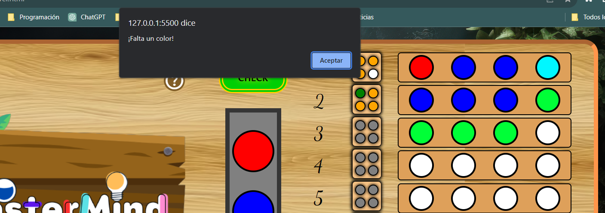
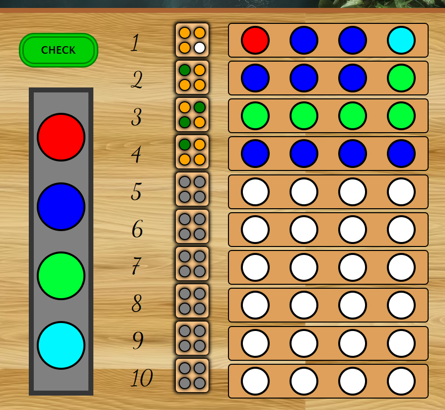
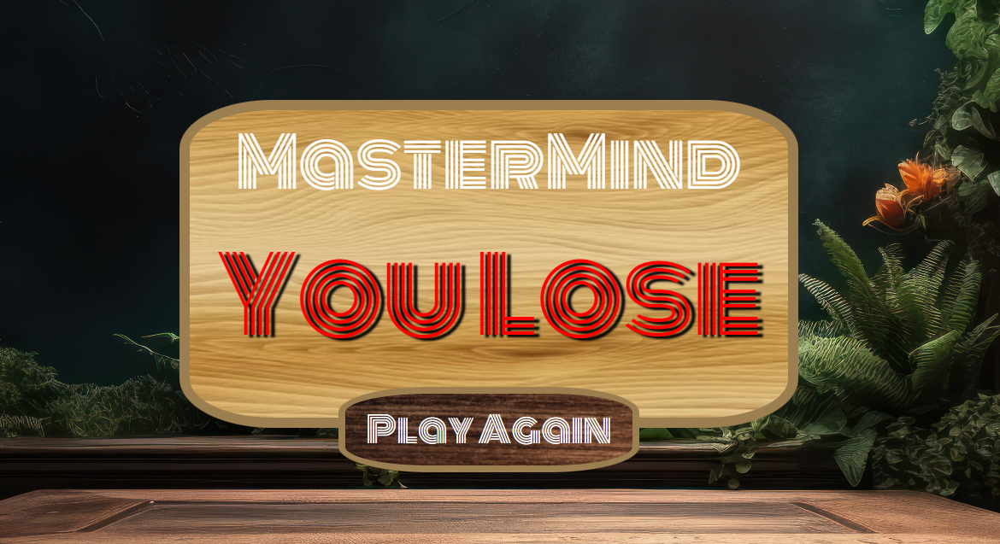
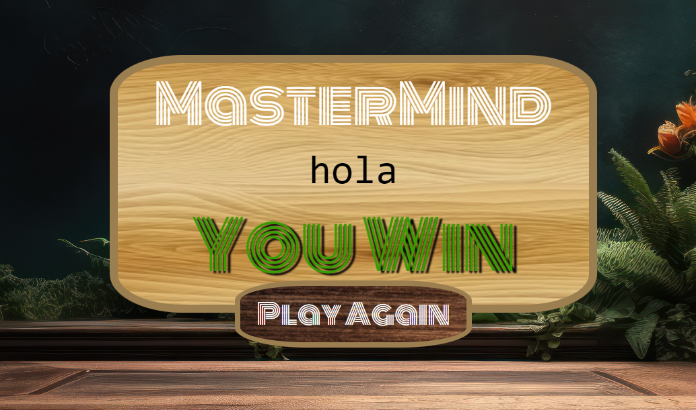
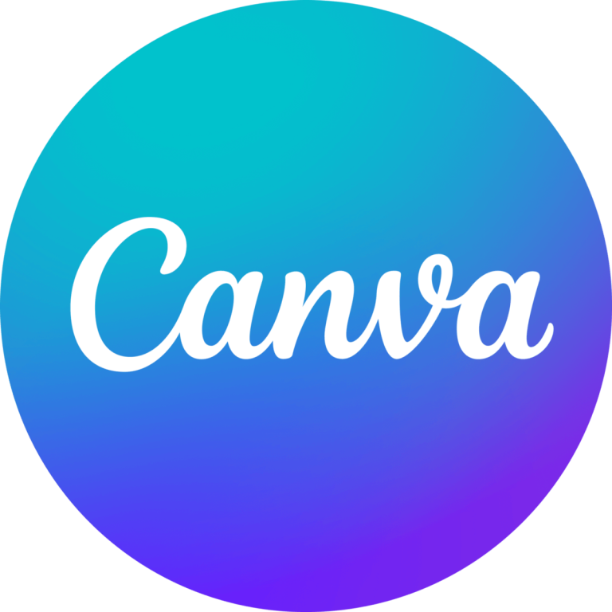

<h1 align="center"> 🕹️MasterMind🕹️</h1>
<h3 align="center"> By Vincenzo Donnarumma</h3>

<a href="https://vincenzo2202.github.io/MasterMind-GH-project2/">https://vincenzo2202.github.io/MasterMind-GH-project2/</a>

 
Desarrollado como parte del tercer proyecto del Bootcamp de Full Stack Developer en Geekshubs Academy.

## Contenido

- [Introducción](#introducción)
- [Características](#📋-características)
- [Problemas y posibles soluciones ](#🚧-problemas-y-posibles-soluciones-💡) 
- [Tecnologías](#tecnologías-utilizadas) 
- [Autor](#📝-autor) 
- [Licencia](#⚖️-licencia)
- [Agradecimientos](#👏-agradecimientos)

_______________________________________________

## Introducción

**Juego MasterMind** es un juego de mesa de estrategia y lógica que generalmente se juega con dos jugadores. Fue inventado por Mordecai Meirowitz en 1970. El objetivo principal del juego es que un jugador adivine una combinación secreta de colores o símbolos elegida por otro jugador, y lo haga en el menor número de intentos posible.

En este caso, el escenario de juego se ejecuta en un tablero donde un solo jugador contra la máquina debe encontrar la combinación correcta.

## 📋 Características

En primer lugar, nos encontramos con el menú de bienvenida y home del juego el cual consta con dos botones, uno que redirige a la reglas del juego, como podemos observar. 

Y el otro botón inicia la partida solicitando el primer dato del jugador el cual es el nombre permitiendo así personalizar la experiencia de usuario.

 

 

 

 

Luego de que el juego hace click nuevamente en play lo lleva al menú donde podrá seleccionar el nivel de dificultad que desee.

 

 

 En esta primera versión de MasterMind solo cuenta con el nivel fácil para en jugador, el cual consta de 4 colores y 10 intentos para conseguir la combinación correcta.

 

 

Luego de seleccionar el nivel de dificultad, el jugador deberá elegir los colores de preferencia para iniciar la partida. 

 

El tablero consta de 10 colores predefinidos entre los cuales podrá elegir 4 colores y ninguno se podrá repetir. 

 

Como forma de facilitar la experiencia, el tablero cuenta con un acceso rápido en el botón de ayuda donde se encuentran alojadas las instrucciones del juego en una ventana desplegable.

 
 

  En la siguiente imagen observamos que el juego cuenta con una serie de restricciones para impedir cambiar de fila sin haber seleccionado todos los colores.

 

 

 La columna que está a la izquierda del tablero de juego es nuestro validador de oportunidades, que no permite ir visualizando que colores son correctos, cuales se encuentran, pero están mal posicionados con color naranja, y cuales directamente no están con el color blanco.

 

Y las ultimas dos páginas representan las ventanas del ganador y el perdedor de las partida.

 

 
 

  
## 🚧 Problemas y posibles soluciones 💡
 Uno de los principales desafíos a la hora de elaborar este proyecto ha sido en donde realmente poner el foco, sobre todo en los momentos más difíciles y de estancamiento el saber dar un paso al lado, continuar con algo que si pudiese realizar en el momento, con más facilidad, para volver a los puntos más arduos luego, más repotenciado. 

La primera toma de contacto con Javascript, sin más, me ha recordado como hace 4 semanas me sentía con HTLM y CSS, en la primera toma de contacto. Ahora, leguajes que con facilidad puedo desarrollar. 

Como problema, puedo mencionar que me hubiese gustado realizar distintos niveles de dificultad, pero por cuestión de tiempo, y ya que, he tenido que refactorizar el código debido a problemas de congruencia.

Tambiene me hubiese gustado tener un nivel dinámico en este proyecto.

## Tecnologías Utilizadas

 
## 📝 Autor

- **Nombre**: Vincenzo Donnarumma Veitia
- **Email**: vincenzodonnarumma22@gmail.com
- **Linkedin**: [LinkedIn](https://www.linkedin.com/in/vincenzo-donnarumma-108755174)

## ⚖️ Licencia

Este proyecto está bajo la Licencia MIT. Consulta el archivo `LICENSE` para obtener más información.

## 👏 Agradecimientos

Este proyecto ha sido posible gracias al arduo trabajo de mis profesores Daniel Tarazona y David Ochando, quienes no solo comparten sus conocimientos, sino que también nos inculcan y generan entusiasmo en lo que estamos desarrollando.

También quiero agradecer a mis compañeros de bootcamp, ya que sin ellos y las lluvias de ideas diarias han ayudado a mejorar muchos aspectos de este proyecto.Como agradecimiento especial a mi compañero de Bootcamp Andrés Labat. Gracias por tu invaluable apoyo y dedicación en este proyecto. Tu ayuda ha hecho una diferencia significativa y estoy realmente agradecido por ello. ¡Trabajar contigo ha sido un placer!" 