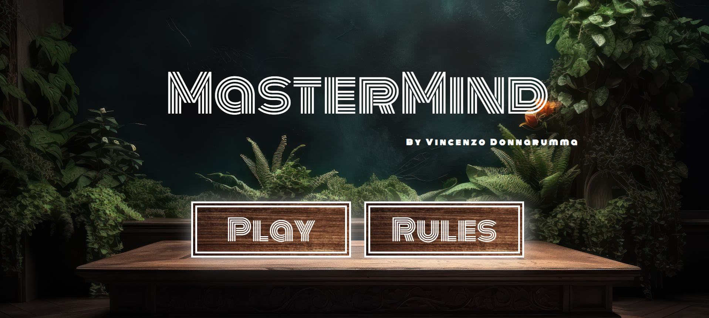
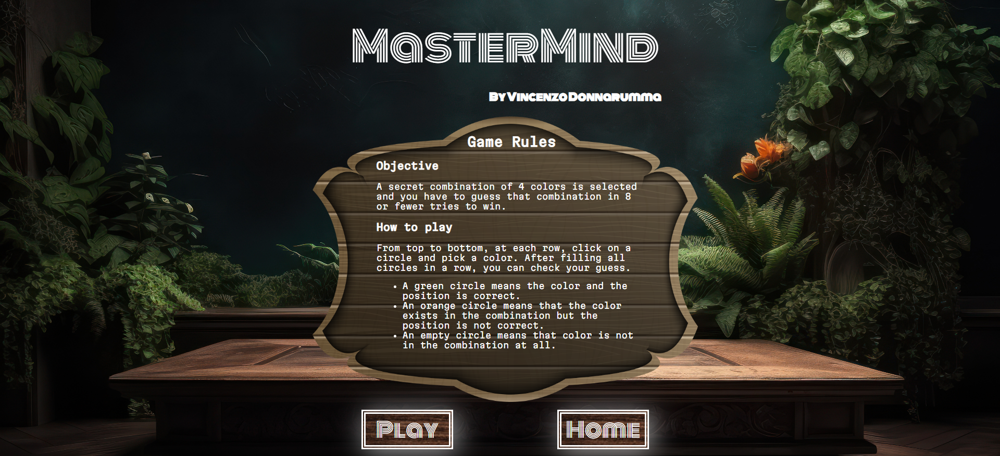
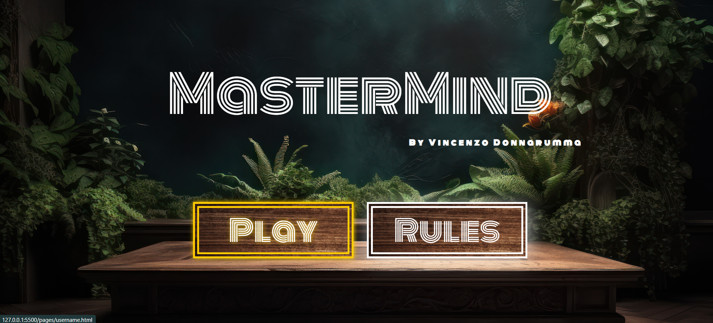
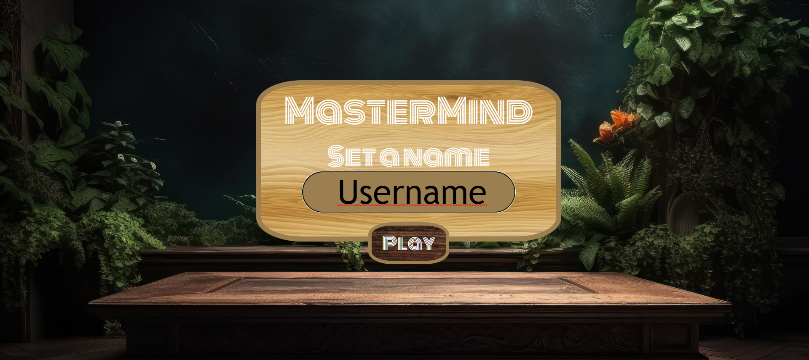
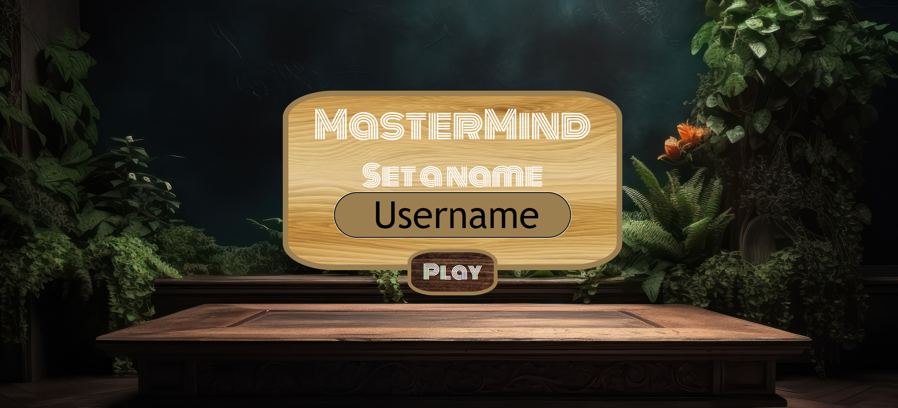
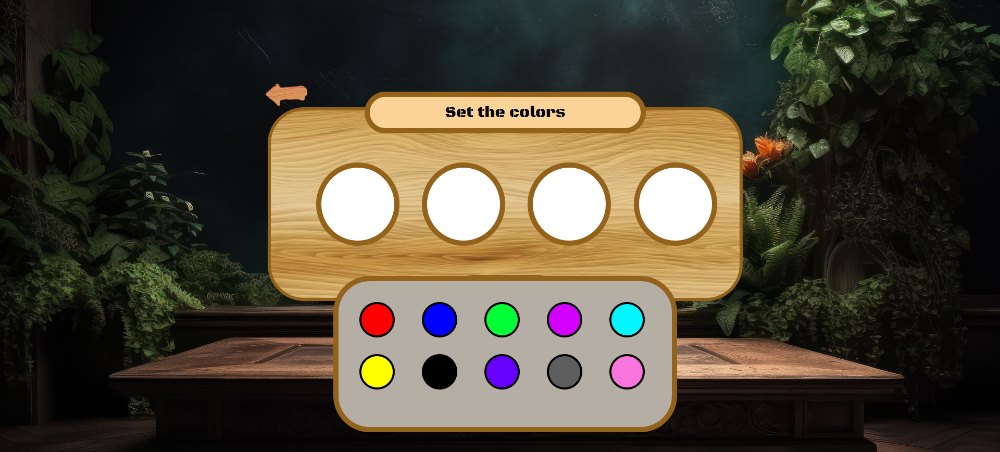
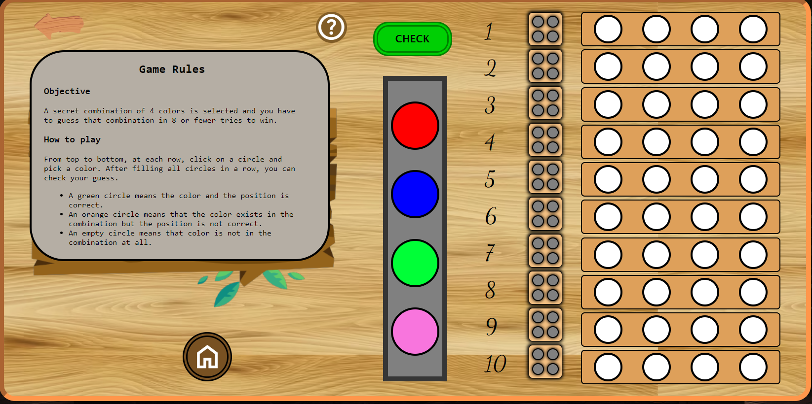
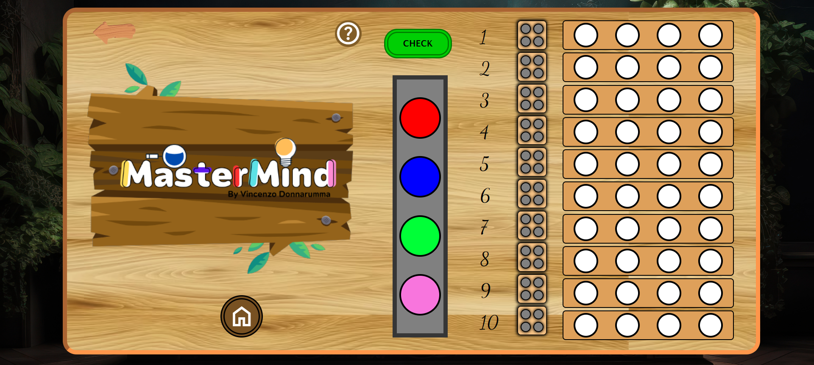
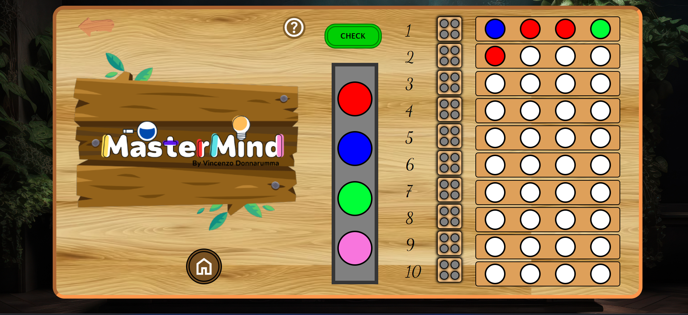
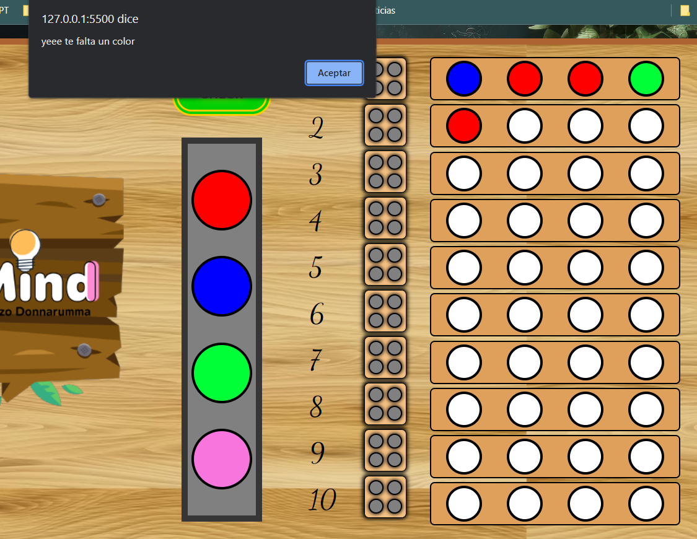

<h1 align="center"> 🕹️MasterMind🕹️</h1>
<h3 align="center"> By Vincenzo Donnarumma</h3>

<a href="https://vincenzo2202.github.io/MasterMind-GH-project2/">Github Pages</a>

 
Desarrollado como parte del tercer proyecto del Bootcamp de Full Stack Developer en Geekshubs Academy.

## Contenido

- [Introducción](#introducción)
- [Características](#📋-características)
- [Problemas y posibles soluciones ](#🚧-problemas-y-posibles-soluciones-💡) 
- [Tecnologías](#tecnologías-utilizadas) 
- [Autor](#📝-autor) 
- [Licencia](#⚖️-licencia)
- [Agradecimientos](#👏-agradecimientos)

_______________________________________________

## Introducción

**Juego MasterMind** es un juego de mesa de estrategia y lógica que generalmente se juega con dos jugadores. Fue inventado por Mordecai Meirowitz en 1970. El objetivo principal del juego es que un jugador adivine una combinación secreta de colores o símbolos elegida por otro jugador, y lo haga en el menor número de intentos posible.

En este caso, el escenario de juego se ejecuta en un tablero donde un solo jugador contra la máquina debe encontrar la combinación correcta.

## 📋 Características
 

    

 

 

 

 

 

 

 

 
 

 

 

 
 

 

 

## 🚧 Problemas y posibles soluciones 💡

## Tecnologías Utilizadas

 
## 📝 Autor

- **Nombre**: Vincenzo Donnarumma Veitia
- **Email**: vincenzodonnarumma22@gmail.com
- **Linkedin**: [LinkedIn](https://www.linkedin.com/in/vincenzo-donnarumma-108755174)

## ⚖️ Licencia

Este proyecto está bajo la Licencia MIT. Consulta el archivo `LICENSE` para obtener más información.

## 👏 Agradecimientos

Este proyecto ha sido posible gracias al arduo trabajo de mis profesores Daniel Tarazona y David Ochando, quienes no solo comparten sus conocimientos, sino que también nos inculcan y generan entusiasmo en lo que estamos desarrollando.

También quiero agradecer a mis compañeros de bootcamp, ya que sin ellos y las lluvias de ideas diarias han ayudado a mejorar muchos aspectos de este proyecto.

 

